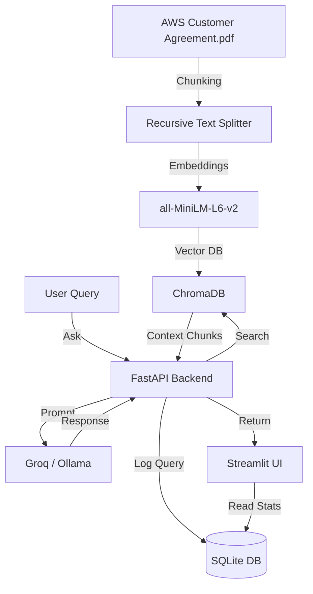

# RAGu: Legal Q&A Assistant & Analytics Dashboard

RAGu is a lightweight Retrieval-Augmented Generation (RAG) system built to answer questions about the **AWS Customer Agreement** PDF. It uses a FastAPI backend, logs query interactions locally in SQLite, and displays performance metrics on a Streamlit dashboard.

It supports two LLM backends:
1. **Groq Cloud API** (Default) - ultra-fast answers using `llama-3.1-8b-instant`.
2. **Local Ollama** - for running completely offline using local models like `llama3.2`.

---

## How it works



---

## Design Choices & Assumptions

*   **Chunking (800 chars / 150 overlap)**: Legal docs are dense and have long clauses. If chunks are too small, sentences get cut in half and lose meaning. If they're too big, we waste token limits and slow down the API. An 800-character chunk size with a 150-character overlap keeps the clauses readable and accurate.
*   **Embeddings**: We used `all-MiniLM-L6-v2` because it runs quickly on local CPUs, is lightweight, and works great for semantic search.
*   **Guardrails**: If someone asks a question that isn't answered in the PDF (like a pizza recipe or football scores), the LLM is instructed to reply with exactly `"Answer not found in context."`. This gets logged in SQLite to help track out-of-scope queries on the dashboard.

---

## Setup & How to Run

Here is how to set it up and run it on your machine.

### 1. Install dependencies
Make sure you have Python 3 installed, then run:
```bash
pip install -r requirements.txt
```

### 2. Add your environment variables
Create a `.env` file in the root directory (you can copy `.env.example`).

*   **To use Groq (Recommended for speed):**
    ```env
    LLM_PROVIDER=groq
    GROQ_API_KEY=your_actual_api_key_here
    GROQ_MODEL=llama-3.1-8b-instant
    ```
*   **To use Ollama (Fully local):**
    ```env
    LLM_PROVIDER=ollama
    OLLAMA_ENDPOINT=http://localhost:11434
    OLLAMA_MODEL=llama3.2
    ```
*(Note: `.env` is ignored by Git, so your API keys will stay safe).*

### 3. Start the FastAPI backend
Run the backend server:
```bash
python3 -m uvicorn app.main:app --host 127.0.0.1 --port 8000
```
This automatically sets up the SQLite database file (`app/query_logs.db`).

### 4. Ingest the document
You need to index the PDF before asking questions. You can do this in two ways:
*   **From the UI**: Go to the **System Architecture** tab on the Streamlit page and click the **Trigger Document Ingestion** button.
*   **Via Command Line**:
    ```bash
    curl -X POST http://127.0.0.1:8000/ingest
    ```
*Note: Ingesting the document will automatically clear both the SQLite logs database and the Chroma DB index so that everything starts fresh.*

#### How to Ingest a Custom PDF
If you want to use your own document instead of the default AWS Customer Agreement:
1. Place your new PDF file in the root directory (e.g., `My_New_Document.pdf`).
2. Open `app/rag.py` and modify line 13 to point to your new filename:
   ```python
   pdf_path = os.path.abspath(os.path.join(os.path.dirname(__file__), "..", "My_New_Document.pdf"))
   ```
3. Trigger re-ingestion from the Streamlit UI or run the `/ingest` POST request.

### 5. Seed test queries (Optional)
If you want to quickly test the charts and dashboard widgets, run the seeding script:
```bash
python3 seed_logs.py
```
*Note: Since Groq's free tier has a limit of 14,400 tokens per minute, the seeder runs queries with a 20-second delay to avoid hitting rate limits.*

### 6. Start the Streamlit UI
Run this command in a new terminal window:
```bash
python3 -m streamlit run frontend.py
```
Open **`http://127.0.0.1:8501`** in your browser.

---

## API Endpoints

### `POST /ingest`
Cleans up the database and parses/indexes the agreement PDF.
*   **Response**:
    ```json
    {
      "message": "pdf ingested successfully",
      "num_chunks": 99
    }
    ```

### `POST /ask`
Submit a question to the RAG pipeline.
*   **Request Body**:
    ```json
    {
      "query": "What is the governing law of the agreement?"
    }
    ```
*   **Response**:
    ```json
    {
      "answer": "The governing law of the agreement is the laws of the State of Washington...",
      "sources": [
        {
          "content": "...Governing Law. The laws of the State of Washington...",
          "metadata": {
            "page": 11,
            "score": 0.3541
          }
        }
      ],
      "latency": 0.25,
      "answer_found": true
    }
    ```

---

## Usage Analytics Benchmark
To verify performance under load and rate limits, a simulation run of 50 consecutive queries (40 in-scope, 10 out-of-scope/irrelevant) was executed with a 10-second request interval using the Groq Cloud API backend. 

### Benchmark Metrics
* **System Decision Accuracy**: 100.0% (The system made the correct decision on all 50 test queries: 31 were correctly answered using document text, and 19 were correctly intercepted with the guardrail fallback)
* **Guardrail Interception Rate**: 100.0% (19/19 out-of-scope or missing queries were successfully prevented from hallucinating)
* **Average Response Latency**: 1.99 seconds (near real-time)
* **Frequent Queries**:
  1. *What is the governing law of the agreement?* (3 hits)
  2. *What is the term of this agreement?* (2 hits)
  3. *What is the definition of AWS Contracting Party?* (2 hits)

This benchmark demonstrates the production-readiness of the FastAPI backend, verifying both rapid response latencies and robust guardrail routing under consistent query volume.
