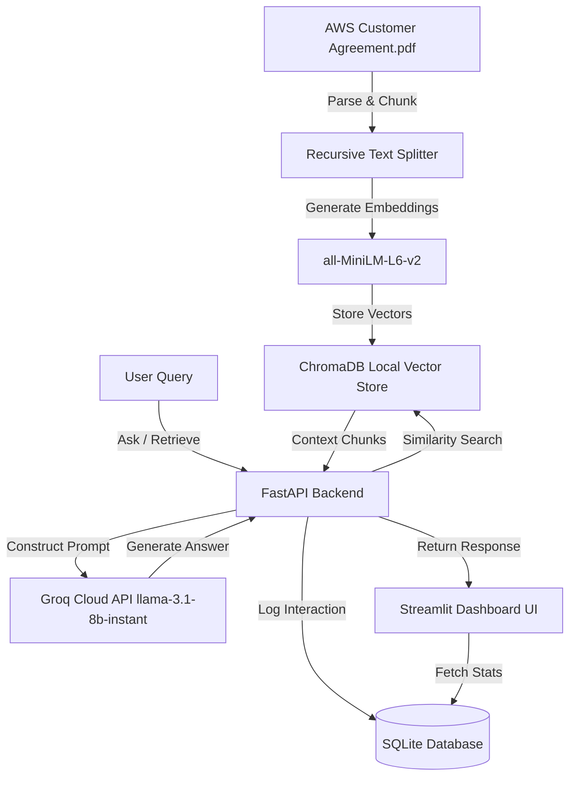

# RAGu: RAG-based Document Q&A System with Analytics Dashboard

An end-to-end Retrieval-Augmented Generation (RAG) system built over the **AWS Customer Agreement** (PDF). The system consists of a FastAPI backend with SQL-based interaction logging and a polished Streamlit analytics dashboard.

---

## 🏗️ System Architecture



The system is split into three main parts:
1. **RAG Pipeline (Core)**: Ingests, chunks, embeds, and indexes the PDF into a local ChromaDB. It queries the Groq Cloud API using the `llama-3.1-8b-instant` model.
2. **FastAPI Backend (`app/main.py`)**: Exposes endpoints `/ingest`, `/ask`, and `/analytics`, running under Uvicorn.
3. **SQLite Logging Layer (`app/database.py`)**: Persists interaction metadata (query, answer, sources, response latency, and resolution success) to a local SQLite database (`query_logs.db`).
4. **Streamlit Frontend (`frontend.py`)**: A premium dark-themed UI that provides a chatbot interface and a detailed analytics view (visualized using Plotly).

---

## 🛠️ Key Design Decisions & Assumptions

### 1. Chunking Strategy
- **Chunk Size**: `800` characters.
- **Chunk Overlap**: `150` characters.
- **Justification**: Legal agreements contain highly structured, dense, and clause-specific sections. If the chunk size is too small (e.g., 200 characters), it partitions sections mid-sentence or mid-definition, losing vital contextual details. If it is too large (e.g., 3000 characters), irrelevant clauses contaminate the prompt context and increase inference latency. An 800-character chunk ensures legal clauses fit within the context, while a 150-character overlap prevents critical boundaries from being truncated at chunk splits.

### 2. Model & Embedding Selections
- **Embeddings**: `sentence-transformers/all-MiniLM-L6-v2` (384-dimensional dense vectors). It runs completely locally on CPU/GPU, is extremely lightweight, and produces high-quality semantic representations.
- **LLM**: Groq Cloud API `llama-3.1-8b-instant` (8 Billion parameters). It is optimized for extremely fast inference (sub-second response latency) and operates at a temperature of `0.0` to maximize factual correctness and prevent hallucination.
- **Safety/Hallucination Guardrails**: The system prompt forces the LLM to reply with exactly `"Answer not found in context."` when the retrieved context lacks the answer. The backend tracks this to flag queries as out-of-scope in the logs.

### 3. Database Schema Design
Interactions are persisted to the SQLite database with the following schema:
- **`id`** (`INTEGER PRIMARY KEY AUTOINCREMENT`): Unique ID per log entry.
- **`timestamp`** (`DATETIME DEFAULT CURRENT_TIMESTAMP`): Date and time of query execution.
- **`query`** (`TEXT NOT NULL`): The user's query text.
- **`answer`** (`TEXT NOT NULL`): The response generated by the LLM.
- **`sources`** (`TEXT NOT NULL`): A JSON string of retrieved chunks (including page numbers and cosine distance/similarity score).
- **`latency`** (`REAL NOT NULL`): Request processing time in seconds.
- **`answer_found`** (`BOOLEAN NOT NULL`): Flag indicating if the LLM successfully resolved the query using the context (set to `False` if it outputted the out-of-scope fallback string).

---

## 🚀 Installation & Setup

### Prerequisites
- Python 3.10+

### 1. Clone & Set Up Environment
```bash
# install dependencies:
pip install -r requirements.txt
```

### 2. Configure API Key
Create a `.env` file in the root of the project:
```bash
GROQ_API_KEY=your_groq_api_key_here
```

### 3. Run FastAPI Backend
Start the backend server on port 8000:
```bash
python3 -m uvicorn app.main:app --host 127.0.0.1 --port 8000
```
*The server will automatically initialize the SQLite log database.*

### 4. Ingest the Document
Trigger the ingestion script by sending a POST request to `/ingest`. This parses and indexes `AWS Customer Agreement.pdf`:
```bash
curl -X POST http://127.0.0.1:8000/ingest
```

### 5. Seed Test Queries
Run the simulation script to seed 35+ test queries (a mix of relevant questions and out-of-scope prompts) to populate the analytics dashboard:
```bash
python3 seed_logs.py
```

### 6. Start the Dashboard UI
Run the Streamlit application in a separate terminal:
```bash
python3 -m streamlit run frontend.py --server.port 8501 --server.address 127.0.0.1
```
Open **`http://127.0.0.1:8501`** in your web browser.

---

## 📈 API Endpoints Reference

### 1. `POST /ingest`
- **Description**: Parses, chunks, embeds, and saves the `AWS Customer Agreement.pdf` text in ChromaDB.
- **Response**:
  ```json
  {
    "message": "PDF ingested successfully",
    "num_chunks": 99
  }
  ```

### 2. `POST /ask`
- **Request Body**:
  ```json
  {
    "query": "What is the governing law of the agreement?"
  }
  ```
- **Response**:
  ```json
  {
    "answer": "The governing law of the agreement is the laws of the State of Washington, without reference to conflict of laws principles...",
    "sources": [
      {
        "content": "...Governing Law. The laws of the State of Washington, without reference to conflict of laws principles, govern this Agreement...",
        "metadata": {
          "page": 11,
          "score": 0.3541
        }
      }
    ],
    "latency": 0.25,
    "answer_found": true
  }
  ```

### 3. `GET /analytics`
- **Description**: Returns statistical metrics based on logged user queries.
- **Response**:
  ```json
  {
    "total_queries": 37,
    "avg_latency": 0.24,
    "success_rate": 67.56,
    "frequent_queries": [
      { "query": "What is the governing law of the agreement?", "count": 3 }
    ],
    "unresolved_queries": [
      { "query": "How to cook a pepperoni pizza?", "timestamp": "2026-06-18 16:13:32", "latency": 0.15 }
    ],
    "latency_history": [
      { "id": 1, "timestamp": "2026-06-18 16:12:28", "latency": 0.28, "answer_found": true }
    ]
  }
  ```
